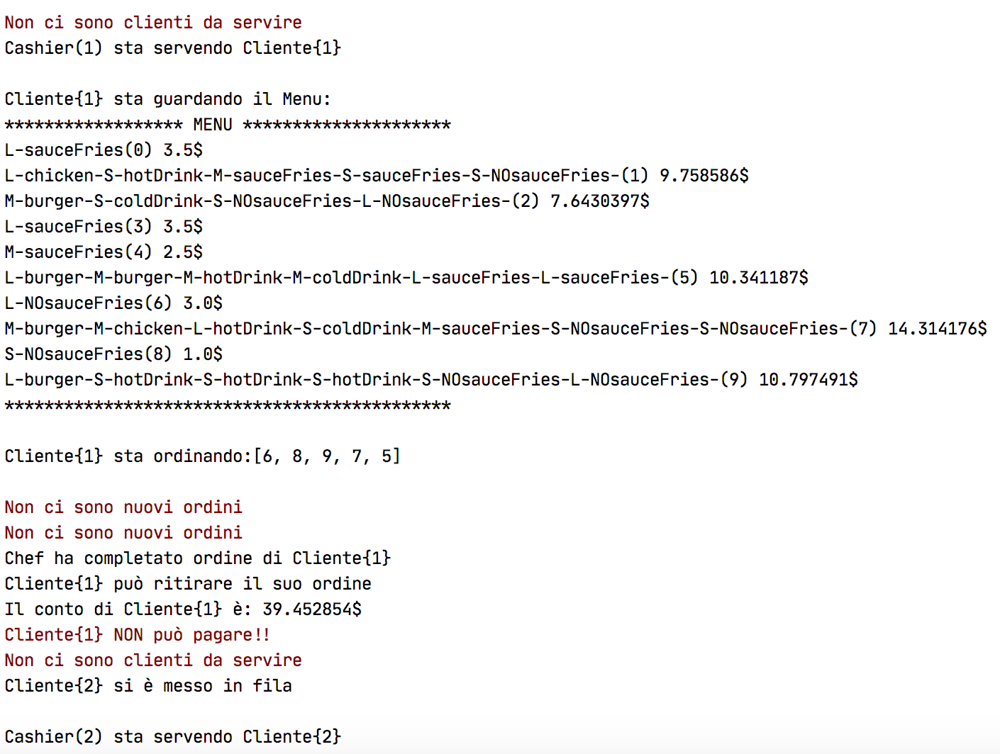

# Fast-Food Model
> Si tratta di un elaborato di micro-progettazione dove, andando ad applicare e combinare tra loro alcuni  schemi progettuali, cerco di simulare il funzionamento di un tipico Fast-Food americano. 
> L’idea è quella di un piccolo locale nel quale entrano una serie di clienti che si mettono in fila in attesa di ordinare dei prodotti. Ogni volta che un cliente effettua un ordine, il cassiere passa l’ordinazione ai cuochi, che si mobilitano a prepararlo, e non appena l’ordinazione sarà pronta, i cuochi notificheranno il cliente che potrà cosi ritirare il suo “sacchetto” e andare via.

# Simulazione

